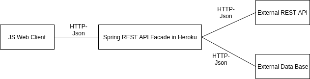

# Laboratorio Bases de Datos No-SQL, Sebastián Reyes
## Links
- Heroku: https://arsw-lab-7.herokuapp.com/

## Arquitectura
La arquitectura consiste de un cliente web asíncrono que por medio de Axios usa servicios REST desplegados en un servidor de Heroku que sirve como un gateway para encapsular llamadas hacia un servicio externo y a una base de datos. El servicio externo (https://www.alphavantage.co/documentation) se usa para consultar las acciones en la bolsa y la base de datos es una base de datos no-sql en MongoDB que esta montada en mlab y se usa para guardar las consultas al servicio externo para no tener que estar consulta nuevamente informacion que ya se consultó. Todos los protocolos de comunicación son sobre HTTP y el formato de los mensajes es JSON.

 
